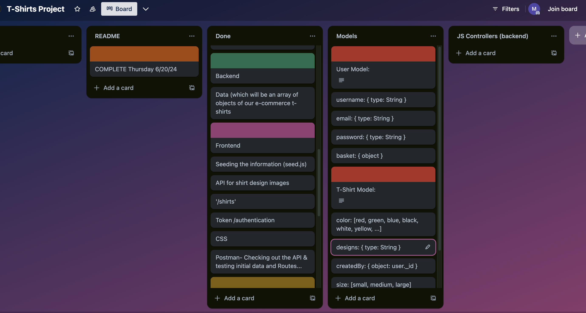

# General Assembly Project 3: Shirtify

## Brief
- The back-end application is built with Express and Node.
- The front-end application is built with React.
- MongoDB is used as the database management system.
- The back-end and front-end applications implement JWT token-based authentication to sign up, sign in, and sign out users.
- Authorisation is implemented across the front-end and back-end. Guest users (those not signed in) should not be able to create, update, or delete data in the application or access functionality allowing those actions.
- The project has at least two data entities in addition to the User model. At least one entity must have a relationship with the User model.
- The project has full CRUD functionality on both the back-end and front-end.
- The front-end application does not hold any secret keys. Public APIs that require secret keys must be accessed from the back-end application.
- The project is deployed online so that the rest of the world can use it.

### Project Members
- Matt Lamb
- [Jasmine Leger](https://github.com/Jasleger88)

### Timeframe
- 7 Days

### Goal
Create a full-stack MERN application with CRUD features, using JWT authentication.

## Shirtify

Shirtify is an application where users can customise shirt colours graphics to create t-shirts that can be added to a private 'Wishlist' and can be seen by other people in the 'Browse' section.
### Concept

We wanted to create an application that allowed users to customise t-shirt designs where they could be saved to their Wishlist (a prototype shopping basket).

### Deployed Version

[Click here to visit Shirtify](https://shirtify-wishlist.netlify.app/).

### Technologies and Dependencies
#### Frontend
- JavaScript
- React
- HTML
- CSS
- Axios
- React-router-dom
- React-toastify
- Bulma
  
#### Backend ([GitHub Link](https://github.com/Polynomial-B/shirtify-mern-backend))
- Express
- MongoDB
- Mongoose
- JSON Web Token
- Bcrypt
- CORS
- Dotenv

#### Development Tools

- VS Code
- Postman
- Git
- Github
- Chrome DevTools
- MongoDB
- Netlify (deployment)
- Trello (planning)
- Excalidraw (wireframing)
- Procreate (image creation and styling)
- Zoom
- Slack

## Planning & Building

#### Wireframe
The app design was created using Excalidraw.

#### Task Allocation
Working on my first paired project, it was important to spend a substantial amount of our time on planning so that we could work as efficiently as possible. We divided and managed tasks through Trello.

### Build

For the build process we did pair programming for the backend, taking it in turns with screen sharing (using Zoom and Slack).

#### Frontend
We did pair programming for the frontend in order to set up authorisation for the 'Signup' and 'Login' pages, using Axios and the useState React hook to update the form data. 
For UX purposes we used the useNavigate hook so that once a user had signed up they would be redirected to the login page. Similarly, once the user has logged in, they are redirected to the 'Browse' page. We then added Toastify for successful and unsuccessful login alerts.

At this point we split into working separately and I focused on creating the 'Design', 'Wishlist' and 'WishItem' pages.

#### Design Page
The design page was made with useState to dynamically update the forms, as I wanted the user to be able to see their progress. i.e. if you select a 'green' shirt then I wanted this to be reflected, visually. The shirt colours were updated with CSS classes that change the image source to the different coloured shirt PNGs, that I edited and styled using Procreate.
I combined the image using CSS `z-index` to overlay the URL image over the t-shirt image. 

## Accreditations
- Pink shirt image from [FlatIcon](www.flaticon.com).
- Other images are URLs to images that can be removed upon request.

## Bugs, Wins and Challenges

### Wins
#### Paired Project
I loved the experience of building an app with somebody else. Because of our careful planning we were able to manage our time effectively. We did this through creating timeframes and by time-boxing extra features.

#### JSON Web Tokens
It was satisfying to successfully implement using JWT for authentication in a build.

### Bugs
There are no known bugs at this point.

A styling error happens on the homepage image. The splash image is too large and pushes the text at the bottom of the page below the viewport.

### Challenges

One of the challenges that I faced was making sure that the URL image was correctly overlayed, centrally, on top of the t-shirt. As I was accounting for different device sizes I used CSS `flexbox`. However, if I were to do this again, I would use CSS `grid`, as I believe it would allow for a more structured and flexible layout, allowing me to better control the placement of the elements.

## Key Learnings, Improvements & Future Features

### Key Learnings
- Improved understanding of how JWT works for managing user authentication.
- Gained insights into working with serverless functions using Netlify and Express.

### Improvements
- I originally wanted to allow users to upload their own images, rather than relying on using URLs, but I was advised not to. I don't think this would be too complicated to implement, using AWS or another cloud storage service, however it might add more steps when considering deployment.

### Future Features
- The ability to choose whether your customised shirt can be publicly viewed. At the moment there is no option and if you create a shirt it will automatically be added to the 'Browse' page where anyone can see it.
- Using React Select for the 'Browse' page filter, so that multiple colours can be chosen at the same time.

