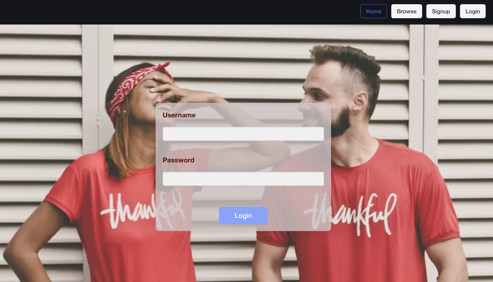
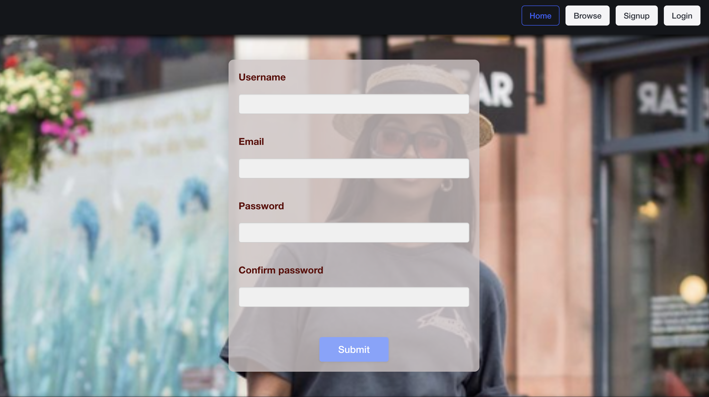
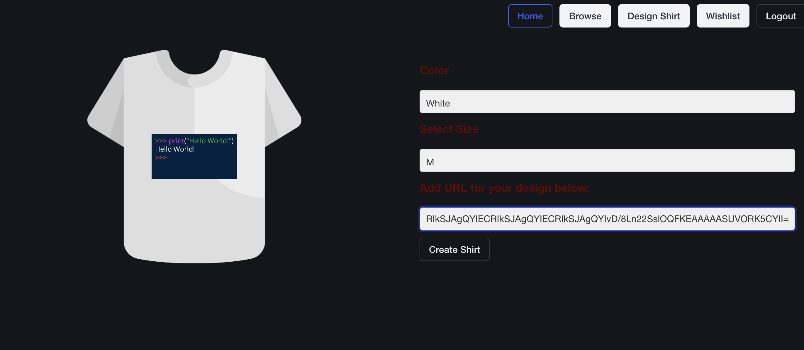
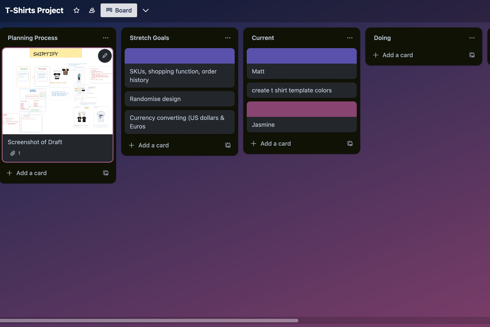

# Shirtify


## Project Overview
Shirtify is a comprehensive web application designed to provide users with an interactive platform to browse, customize, and share a collection of shirts.Users can sign up, create a profile, and log in to utilize the app's full functionality. Upon logging in, users can explore an extensive collection of shirts, add shirts to their wishlist, and personalize shirts by inserting designs and selecting sizes.The app supports full CRUD functionality for managing wishlists, enabling users to create, read, update, and delete shirt entries.Customized shirts can be shared in the browse collection, allowing other users to add these shirts to their wishlists. 

## Link to Shirtify

https://shirtify-wishlist.netlify.app

## Inspiration

The idea for Shirtify stemmed from the desire to create a personalized and community-oriented shopping experience. <br />
By enabling users to customize and share their shirt designs, the app encourages creativity and interaction among its users. <br />
The goal was to develop an engaging platform where users can express their unique style and preferences while discovering and interacting with the designs of others. <br />

## Planning Process


## Features
1. User Authentication: Secure sign-up, login, and profile management.
2. Browse Collection: Explore a wide variety of shirts created by other users.
3. Wishlist Management: Add, update, and delete shirts in the user's wishlist.
4. Shirt Customization: Insert designs and select sizes for shirts.
5. Community Sharing: Save customized shirts to the browse collection for others to discover.








## Challenges and Solutions
* Challenge: Formulating the logic to manage the complex interactions and data flow between user wishlists and the browse collection.
* Solution: Implementing a robust backend architecture with clear separation of concerns. Using controllers 
to handle specific routes and middleware for secure routes and token-based authentication.

## Group Project Experience
This was a group pair project that went well. Communication was essential, as well as delegating tasks to each other.
We helped each other debug the code and fix any issues that arose.



# Components Included

* Frontend Components:
Pages: Home, Login, Signup, Navbar
Components: WishItem, Wishlist
Main App: App.jsx

* Backend Components:
Configuration: environment.js
Controllers: auth.js, shirt.js, wishlist.js
Database: MongoDB, seeded data, seed.js, helpers.js
Custom Errors: customErrors.js
Middleware: Error handling, secure routes
Models: shirt.js, user.js

# Technologies Included

* Technologies:
Frontend: HTML, CSS, JavaScript, React, Bulma (CSS library)
Backend: Node.js, Express.js
Database: MongoDB
Authentication: JSON Web Tokens (JWT)
API Testing: Postman
Middleware Libraries: Method-override, Morgan, Dotenv
Package Management: package.json

# MERN Integration 

## Frontend App.Jsx
```
import { BrowserRouter as Router, Routes, Route } from "react-router-dom";
import Navbar from "./components/Navbar";
import Home from "./components/Home";
import Signup from "./components/Signup";
import { ToastContainer } from 'react-toastify'
import Login from "./components/Login";
import Browse from "./components/Browse";
import Design from "./components/Design"
import Wishlist from "./components/Wishlist";
import WishItem from "./components/WishItem";

function App() {
  return <>

  <Router>
  <ToastContainer
  autoClose={1300}/>
    <Navbar />
    <Routes>
      <Route path="/" element={<Home />} />
      <Route path="auth/signup" element={<Signup />} />
      <Route path="auth/login" element={<Login />} />
      <Route path="shirts/browse" element={<Browse />} />
      <Route path="shirts/design" element={<Design />} />
      <Route path="/wishlist" element={<Wishlist />} />
      <Route path="/wishlist/:wishId" element={<WishItem />} />
    </Routes>
  </Router>
  
  </>
}

export default App

```

##Backend Seed.js


```
import Shirt from "../models/shirt.js";
import User from "../models/user.js";
import { connectToDb, truncateDb, disconnectDb } from './helpers.js'
import seedData from './seedData.js'


async function seed() {
  
      await connectToDb()
     
      await truncateDb()
    
  
      const adminUser = await User.create({
        username: 'admin',
        email: 'admin@email.com',
        password: 'password',
        isAdmin: true,
      })
      
  
      const shirtsWithCreatedByAdmin = seedData.map(shirt => {
        shirt.createdBy = adminUser
        return shirt
      })

      const shirts = await Shirt.create(shirtsWithCreatedByAdmin)

    await disconnectDb()
  
  }
  
  seed()

```
# Frontend Dependencies 
```
{
    "axios": "^1.7.2",
    "react": "^18.3.1",
    "react-dom": "^18.3.1",
    "react-router-dom": "^6.23.1",
    "react-toastify": "^10.0.5"
  }
```

# Backend Dependencies 
```
 {
    "axios": "^1.7.2",
    "bcrypt": "^5.1.1",
    "cors": "^2.8.5",
    "dotenv": "^16.4.5",
    "express": "^4.19.2",
    "jsonwebtoken": "^9.0.2",
    "mongoose": "^8.4.1",
    "mongoose-hidden": "^1.9.1",
    "mongoose-unique-validator": "^5.0.0",
    "nodemon": "^3.1.3",
    "toastify": "^2.0.1"
  }

```
# Deployment


This project is deployed using Netlify, leveraging GitHub integration for seamless updates. Here’s a detailed outline of the deployment process:

* Deployment Setup
Netlify Configuration:

1. The project is hosted on Netlify to streamline deployment and hosting processes.
Continuous deployment is enabled by linking the project directly to the GitHub repository.
Environment Variables:

2. For security reasons, sensitive information such as API keys or credentials are stored in environment variables.
* These variables are managed using Netlify’s environment variable settings, ensuring they are securely stored and accessible only during deployment.

3. Steps for Deployment
Push to GitHub:

* Any changes made to the project are first committed and pushed to the GitHub repository.
Automatic Deployment:

4. Netlify is configured to monitor the GitHub repository.
* Upon detecting changes (commits or merges to the main branch), Netlify automatically triggers a new build and deployment process.

5. Build Process:
* During deployment, Netlify installs dependencies, compiles assets, and prepares the application for hosting.
* Any environment variables configured on Netlify are injected during this build process.
Hosting:

6. Once the build process is complete, Netlify hosts the deployed application.
* The application is accessible via a secure URL provided by Netlify.
Local Development and Testing
* For local development, ensure necessary environment variables are set in a .env file (not committed to GitHub) or configured in your local development environment.


